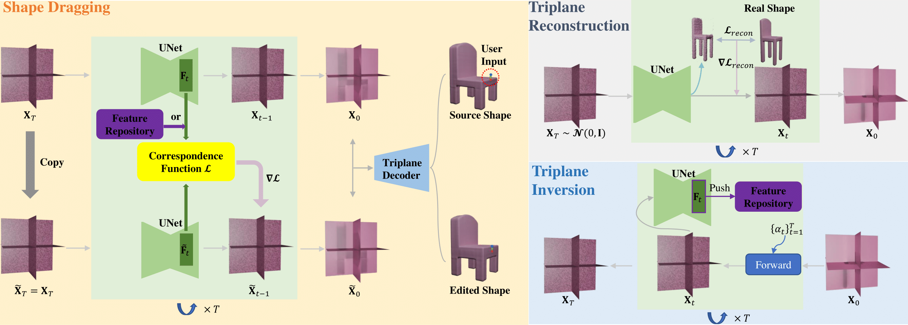
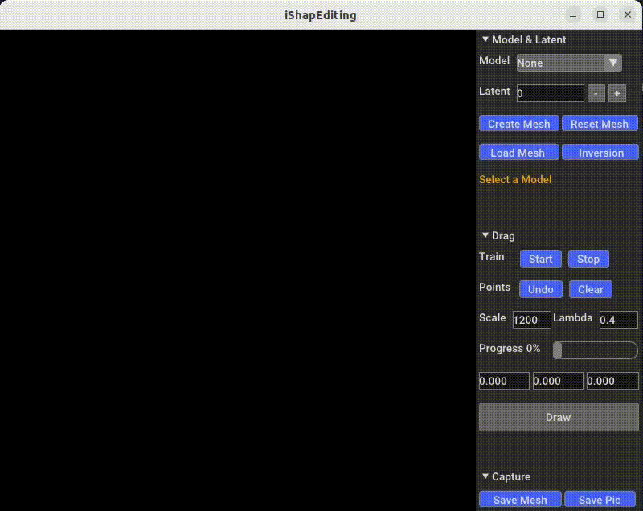
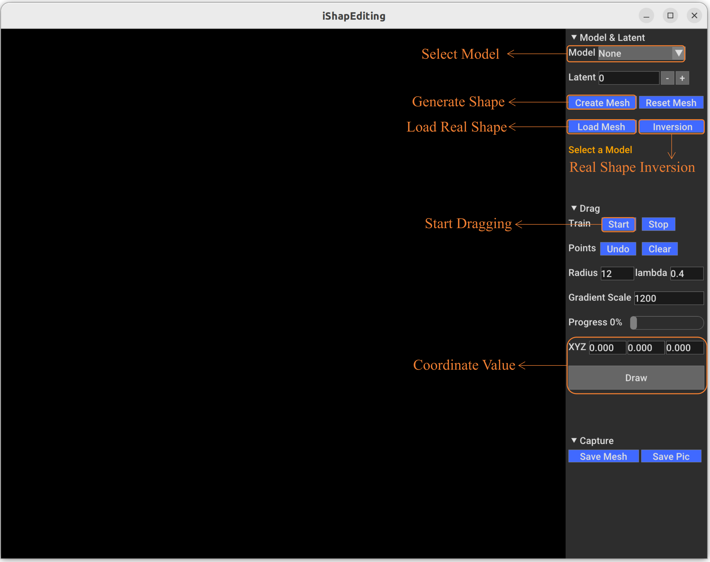

# iShapEditing: Intelligent Shape Editing with Diffusion Models (PG 2024)




Abstract: *Recent advancements in generative models have enabled image editing very effective with impressive results. By extending this progress to 3D geometry models, we introduce iShapEditing, a novel framework for 3D shape editing which is applicable to both generated and real shapes. Users manipulate shapes by dragging handle points to corresponding targets, offering an intuitive and intelligent editing interface. Leveraging the Triplane Diffusion model and robust intermediate feature correspondence, our framework utilizes classifier guidance to adjust noise representations during sampling process, ensuring alignment with user expectations while preserving plausibility. For real shapes, we employ shape predictions at each time step alongside a DDPM-based inversion algorithm to derive their latent codes, facilitating seamless editing. iShapEditing provides effective and intelligent control over shapes without the need for additional model training or fine-tuning. Experimental examples demonstrate the effectiveness and superiority of our method in terms of editing accuracy and plausibility.*

[[Project Page]](https://jinli99.github.io/iShapEditing/) | [[Paper]](https://onlinelibrary.wiley.com/doi/abs/10.1111/cgf.15253)

## Features
- 🎯 Intuitive point-based shape editing interface
- 🔄 Support both generated and real shapes
- 🚫 No additional training or fine-tuning required
- 🎨 Compatible with multiple shape categories (chair/car/airplane)
- 💪 Robust shape preservation during editing

## Installation
Clone this repository
```bash
git clone https://github.com/jinli99/iShapEditing
cd iShapEditing
```

Create conda environment and install dependencies
```
conda create --name iShapEditing python=3.10 -y
conda activate iShapEditing

conda install pytorch==1.12.0 torchvision==0.13.0 torchaudio==0.12.0 cudatoolkit=11.6 -c pytorch -c conda-forge
pip install -r requirements.txt
```

Download the pre-trained Triplane Diffusion models from this [link](https://github.com/JRyanShue/NFD), and save them (chair, car, airplane) to `model` folder.

## GUI Usage
Simple demo
<p align="center">
    
</p>

Step 1: **Launch the GUI**
```
python main.py
```
<p align="center">
    
</p>

Step 2: **Choose model category (chair/car/airplane)**.

Step 3: **Source shape initialization**
- For generated shapes: click the `Create Mesh` to generate a random shape.
- For real shapes: click the `Load Mesh` to import your mesh file. And then click the `Inversion` to perform triplane reconstruction and inversion. 

Step 4: **Control points placement**
   - Source Points: Define handle positions on the shape.
   - Target Points: Specify desired destinations.
   - Two input methods:
     * Direct selection: Hold `Ctrl` + Left click on shape surface.
     * Manual input: 
       - Enter coordinates in XYZ editor.
       - Click `Draw` to confirm.
       > Note: For target points, XYZ values represent relative displacement from corresponding source points

Step 5: Click `Start` to execute editing.

## Citation
If you find our work useful in your research, please cite:
```
@inproceedings{li2024ishapediting,
  title={iShapEditing: Intelligent Shape Editing with Diffusion Models},
  author={Li, Jing and Zhang, Juyong and Chen, Falai},
  booktitle={Computer Graphics Forum},
  pages={e15253},
  year={2024},
  organization={Wiley Online Library}
}
```